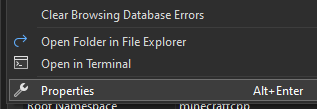
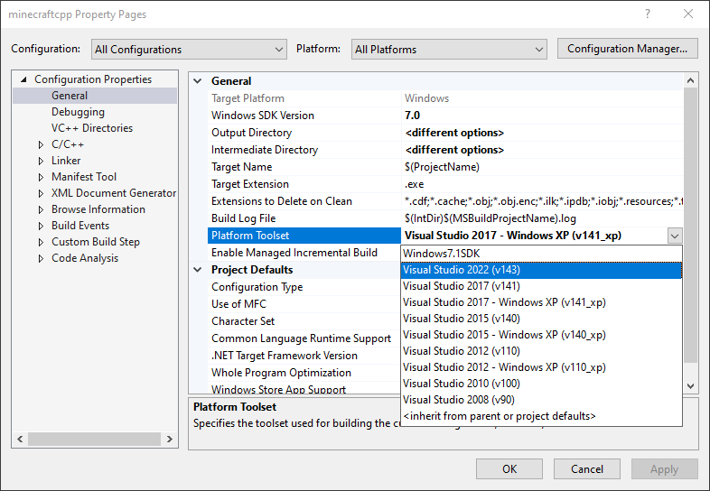
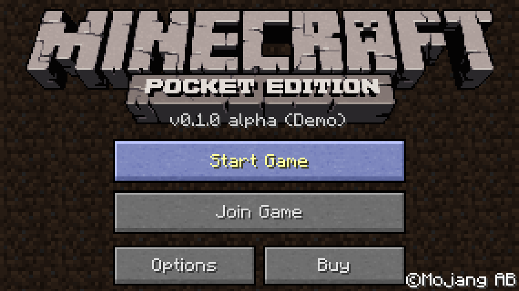
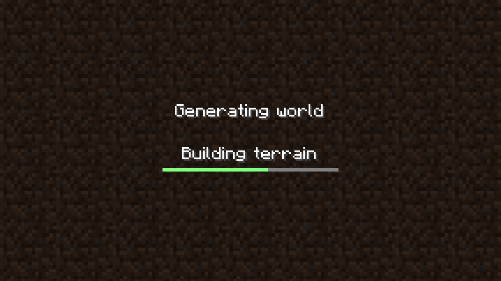
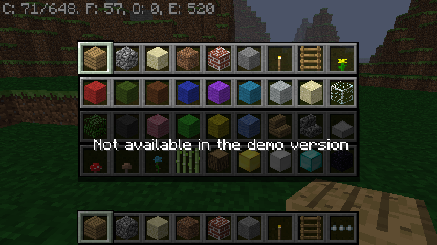
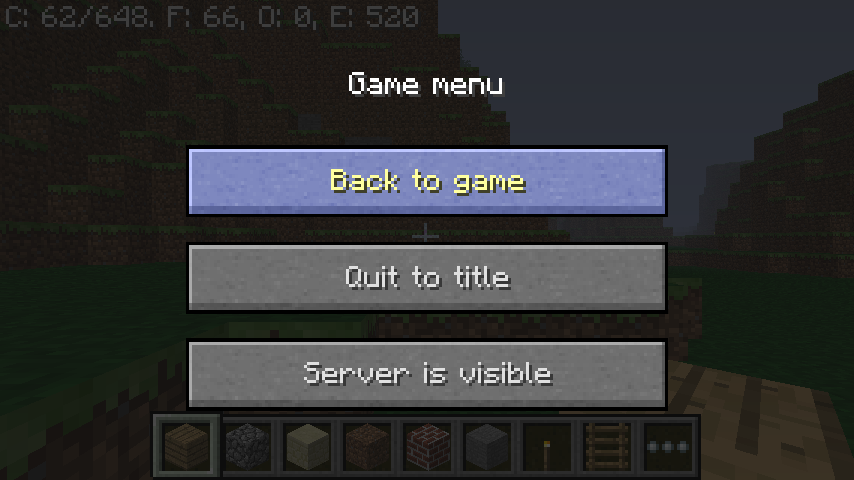

# ReMinecraftPE

This project aims to provide a customizable, cross-platform, legacy Minecraft experience.
The code is based on a decompilation of Minecraft: Pocket Edition (v0.1.3) as of 2011, which itself is a port of Minecraft: Java Edition (Beta 1.3-1.7.3).

**Its goals are:**
* To add features from Minecraft Beta 1.7.3 and below.
* To add togglable edition-specific aesthetic features.
  Some examples include:
  * Legacy Console Edition gamma and mipmaps
  * Pocket Edition sky colors
  * Normal lighting (something Pocket Edition lacked)
  * Alpha title logo
* To (in the future) provide a cross-platform modding API in a language like [Luau](https://luau.org/), giving more creative control to the community.
* To keep the source code layout similar to the original Minecraft PE (reconstructed from clues hidden within
  certain versions of the game, such as the 0.1.0 touch prototype/debug build)
* To add support for as many platforms as possible, such as the Xbox 360, PlayStation 3, Wii, and more.
  Currently, the following platforms are supported:
	* Windows (2000 and above; thanks to [iProgramInCpp](https://github.com/iProgramMC))
	* Android (thanks to [Stom](https://github.com/Stommm) for the help)
	* Linux
	* WebGL
	* macOS (10.4 and above; thanks to [BrentDaMage](https://github.com/BrentDaMage))
	* iOS (3.0 and above; thanks to [BrentDaMage](https://github.com/BrentDaMage))
	* HaikuOS (thanks to [SanyaSho](https://github.com/SanyaSho))

**We will not do the following:**
* Add features added in or after Java Edition Beta 1.8
* Change the default aesthetic the game is shipped with. We're currently targeting Java Edition Beta 1.7.3.
  Players can use the options menu to change the game's aesthetic to match the version/edition of their liking.
* Add Herobrine
* Add support for Minecraft Java or Minecraft Bedrock servers. (although LAN play with original MCPE clients
  will be supported for as long as possible)

Note: While the original Minecraft PE v0.1.3 may not work on newer devices, ReMinecraftPE works on any of the platforms listed above.

### This is a modified version of [the original Minecraft PE v0.1.3 decompilation](https://github.com/ReMinecraftPE/mcped).

## License information

This project is licensed under the [BSD 1 clause license](LICENSE.txt). However, it contains third party
software with different but compatible licenses:

- [RakNet](https://github.com/facebookarchive/RakNet): [Licensed under the BSD 2 clause license](thirdparty/raknet/LICENSE)
- [zlib](https://github.com/madler/zlib): [View license](thirdparty/zlib/LICENSE)
- [coi-serviceworker](https://github.com/gzuidhof/coi-serviceworker): [View license](https://github.com/gzuidhof/coi-serviceworker/blob/master/LICENSE). Embedded as a submodule.
- [stb](https://github.com/nothings/stb): [View license]([https://github.com/gzuidhof/coi-serviceworker/blob/master/LICENSE](https://github.com/nothings/stb/blob/master/LICENSE)). Embedded as a submodule.

## WANT TO HELP?

Want to help this project? Here's [a list of things to do.](https://github.com/ReMinecraftPE/mcpe/issues)
Once your code is tested and ready, [submit a pull request](https://github.com/ReMinecraftPE/mcpe/pulls).

## Prep for Building

Before trying to build:

1. Run the following `git` commands, or perform the following actions with Git:
```
git submodule init
git submodule update
```
This fetches the project's necessary dependencies.

2. It is recommended that you have a copy of the Minecraft PE v0.1.3 APK (SHA256 of the `libminecraftpe.so`
inside: `157af341d13a54cc935bbe24c5e1cf3d02d7e40ec20f9859b9853c2e996ebd81`), to extract assets from. Otherwise, the minecraft.jar file from Java Edition Beta 1.7.3 should work _more or less_.

3. Copy the assets (including sounds and textures) into the necessary folders within the project.<br>
   Do this by performing <ins>**one**</ins> of the following:
   - To extract all assets from _Pocket Edition_:
     - **Run the following command**:
     - `tools/extract_apk.py /path/to/the/apk`
     - You can also run it with an interactive GUI by not providing arguments.
   - To extract only the sounds from _Pocket Edition_:
     - **Run the following command**:
     - `tools/grabsounds.py /path/to/the/apk/lib/armeabi-v7a/libminecraftpe.so`
     - You will need to extract textures and other assets manually.
   - To retrieve only the sounds from _Java Edition_:
     - Locate the `resources` directory in the `.minecraft` folder and copy its contents (e.g. `music`, `sound`, etc.) into the `game/assets/` directory of the project.
     - You will need to extract textures and other assets manually from _Pocket Edition_.

## How to Build

### Windows

Click the thumbnail below to watch a video guide showcasing how to build ReMCPE.
<a href="https://youtu.be/Tx1u7C2DCPI" target="_blank">
  
</a>

The project is configured to target Windows XP by default by using "v141_xp" build tools. If you would like
to build with Windows XP support, please follow the guide [here](https://learn.microsoft.com/en-us/cpp/build/configuring-programs-for-windows-xp?view=msvc-170#install-the-windows-xp-platform-toolset)
to obtain the build tools via the Visual Studio installer.

**If you would like to strictly target more modern versions of Windows, you can change the build toolset by
doing the following:**

1. Right-click the project and click "Properties".




2. Click the dropdown for the "Platform Toolset" property and select "Visual Studio 2022 (v143)" or newer.


3. Click "Apply".

Install the [DirectX SDK (June 2010)](https://www.microsoft.com/en-US/download/details.aspx?id=6812), unless:
- You opt to use OpenAL instead (but that will require some hacking)
- You are using the latest platform toolset

Once you have the proper build tools installed (v140_xp or newer), you can now build it.

After building, place the `assets` folder you have prepared in the working directory of the output executable.
(if running from VS, it's in `game/`, otherwise, where your executable is)

### WebAssembly

**Make sure you have CMake and Ninja installed. On Windows, the ninja executable must be in your PATH.**
On Linux, the package names are `cmake` and `ninja-build` respectively if you are using apt.

The game will use the assets from within the `game/` directory. So put your assets there if you want to build
for wasm. Then run the `build-wasm` script corresponding to your platform (`-.sh` on linux/WSL, `-.bat` on
windows).

The output files will be in `./wasm/dist`, but you need to upload them to a web host (localhost works too) to
use. (problem with Emscripten)

**NOTE:** If you are using nginx, make sure the `*.wasm` file is served as `application/wasm`, and not
`application/octet-stream`. This can be done by opening `/etc/nginx/mime.types` as root and adding
`application/wasm wasm;` to the types block.

### Linux

This project uses CMake on Linux. Just like WebAssembly, the game assets must be placed in the `game/` directory.

#### Dependencies (Ubuntu/Debian)

- `build-essential` (C/C++ Toolchain)
- `cmake` (CMake)
- `ninja-build` (Ninja)
- `libsdl2-dev` (SDL2)
- `libopenal-dev` (OpenAL)
- `zlib1g-dev` (ZLib)

#### How To Build

```sh
mkdir build && cd build
cmake -GNinja ..
cmake --build .
# Run
./reminecraftpe
```

### HaikuOS

Dependencies:
- `libsdl2_devel` (SDL2)
- `glu_devel mesa_devel` (Mesa)
- `cmake` (CMake)
- `ninja` (Ninja)

To build, perform the same steps as on Linux.
 
## Have seams when playing?

I've had texture seams when playing Minecraft Classic, ClassiCube and this recreation of Minecraft PE, on a
fresh new laptop. If seams bother you, and you are using an NVIDIA graphics card, go to the NVIDIA Control
Panel, then in "Manage 3D Settings", change "Antialiasing - Mode" to "Application Controlled".
a custom script which downloads and sets up all assets needed for the game.

## Screenshots (from the decomp)







## Enhancements

ReMinecraftPE is an enhanced version of the original decompilation. To see the original, (mostly) unmodified code,
[see the mcped repository](https://github.com/ReMinecraftPE/mcped).

