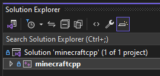
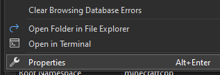
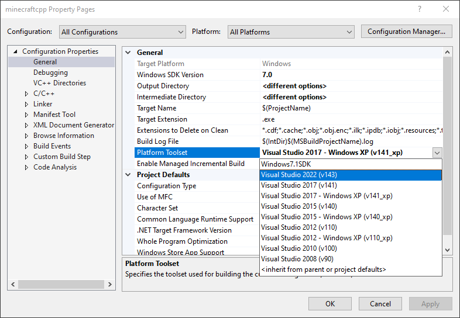
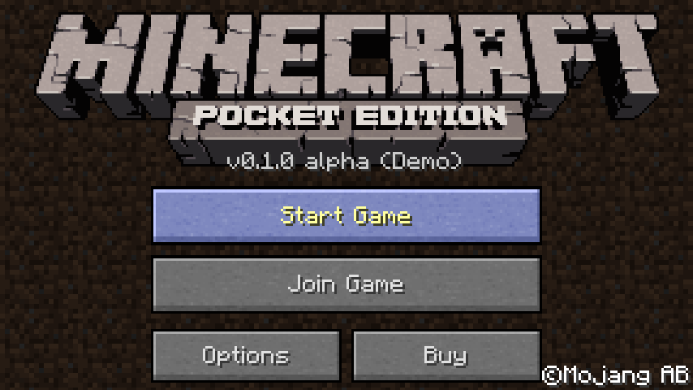
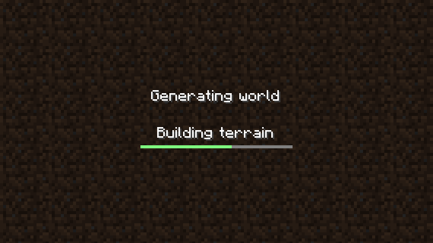
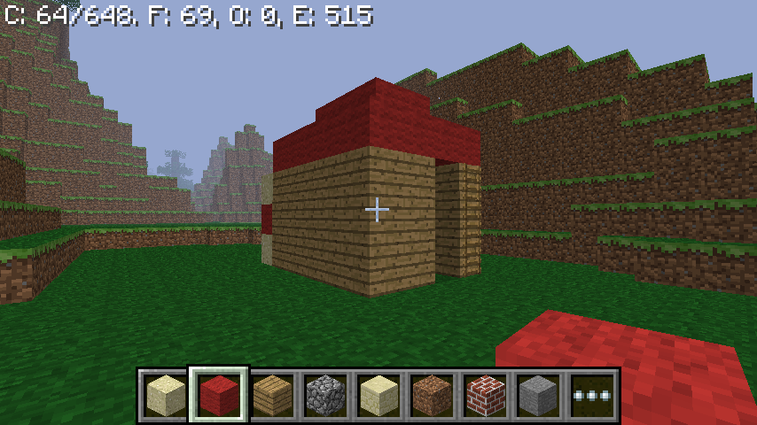
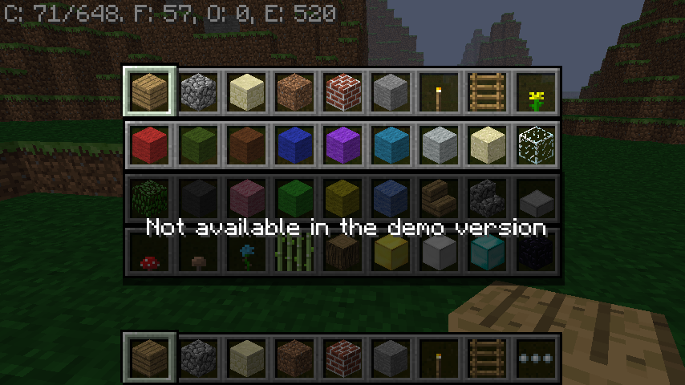
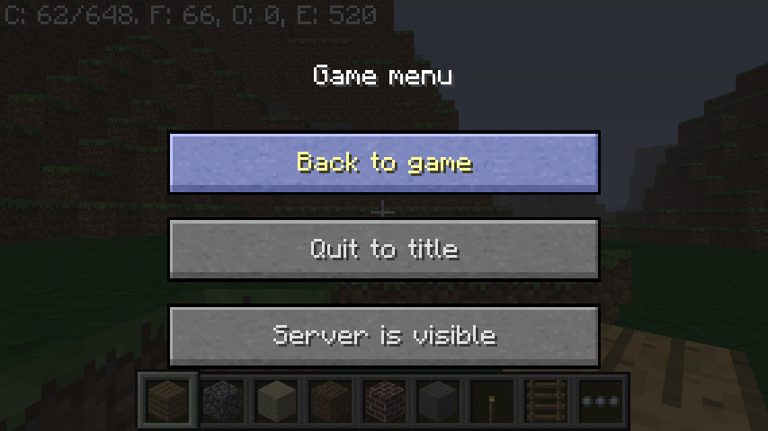

# NBCraft (NBC)

## Disclaimer
**NBCraft is not affiliated or associated with Minecraft, Mojang AB, or Microsoft.**<br>
To be absolutely clear:<br>
**THIS IS NOT AN OFFICIAL MINECRAFT PRODUCT AND IS NOT APPROVED BY OR ASSOCIATED WITH MOJANG OR MICROSOFT**

## About
This project aims to provide a customizable, cross-platform, legacy mining experience.<br>
The code is based on a decompilation of Minecraft: Pocket Edition (v0.1.3) as of 2011, which itself is a port of Minecraft: Java Edition (Beta 1.3-1.7.3).<br>
The decompilation was performed primarily using [IDA](https://hex-rays.com/ida-pro) in conjunction with Android builds of MCPE, since these contain info such as function and class names.<br>

**Its goals are:**
* To add features from Minecraft Beta 1.7.3 and below.
* To add togglable edition-specific aesthetic features.
  Some examples include:
  * Legacy Console Edition UI theme, gamma, and mipmaps
  * Pocket Edition UI theme and sky colors
  * Java Edition UI theme
  * Normal lighting (something Pocket Edition lacked)
  * Alpha title logo
* To (in the future) provide a cross-platform modding API in the form of [WebAssembly](https://webassembly.org/) modules, giving more creative control to the community.
* To keep the source code layout similar to the original Minecraft PE (reconstructed from clues hidden within
  certain versions of the game, such as the 0.1.0 touch prototype/debug build)
* To add support for as many platforms as possible, such as the PlayStation 3, Wii, and more.
  Currently, the following platforms are supported:
	* Windows (2000 and above; thanks to [iProgramInCpp](https://github.com/iProgramMC))
	* Android (thanks to [Stom](https://github.com/Stommm) for the help)
	* Linux
	* WebGL
	* macOS (10.4 and above; thanks to [BrentDaMage](https://github.com/BrentDaMage))
	* iOS (3.1 and above; thanks to [BrentDaMage](https://github.com/BrentDaMage))
	* Xbox 360 (thanks to [BrentDaMage](https://github.com/BrentDaMage))
	* HaikuOS (thanks to [SanyaSho](https://github.com/SanyaSho))
	* Nintendo Switch (thanks to [Bagietas](https://github.com/Bagietas))

**We will not do the following:**
* Add features added in or after Java Edition Beta 1.8
* Change the default aesthetic the game is shipped with. We're currently targeting Java Edition Beta 1.7.3.
  Players can use the options menu to change the game's aesthetic to match the version/edition of their liking.
* Add Herobrine
* Add support for Minecraft Java or Minecraft Bedrock servers. (although LAN play with original MCPE clients
  will be supported for as long as possible)

Note: While the original Minecraft PE v0.1.3 may not work on newer devices, NBCraft works on any of the platforms listed above.

### This is a modified version of [the original Minecraft PE v0.1.3 decompilation](https://github.com/nbcraft-org/mcped).

## Where'd the name come from?
We came up with "NBCraft" by combining the last names of the three original developers of Minecraft: Pocket Edition;<br>
Aron Nieminen, Johan Bernhardsson, and Tommaso Checchi. While they were not the only developers working on Pocket Edition at the time, they played a pivotal role in the game's development.<br>
Ultimately, these three guys made Minecraft what it is today.

## License information

This project is licensed under the [BSD 1 clause license](LICENSE.txt). However, it contains third party
software with different but compatible licenses:

- [RakNet](https://github.com/facebookarchive/RakNet): [Licensed under the BSD 2 clause license](thirdparty/raknet/LICENSE)
- [zlib](https://github.com/madler/zlib): [View license](thirdparty/zlib/LICENSE)
- [coi-serviceworker](https://github.com/gzuidhof/coi-serviceworker): [View license](https://github.com/gzuidhof/coi-serviceworker/blob/master/LICENSE). Embedded as a submodule.
- [stb](https://github.com/nothings/stb): [View license]([https://github.com/gzuidhof/coi-serviceworker/blob/master/LICENSE](https://github.com/nothings/stb/blob/master/LICENSE)). Embedded as a submodule.

## WANT TO HELP?

Want to help this project? Here's [a list of things to do.](https://github.com/nbcraft-org/nbcraft/issues)
Once your code is tested and ready, [submit a pull request](https://github.com/nbcraft-org/nbcraft/pulls).

## USING BETA ASSETS

Prepare a copy of minecraft.jar from Beta 1.7.3.
Then, copy the assets (including sounds and textures) into the "minecraft" resource pack within the project.<br>
   Do this by performing the following:
   - If you have [Python](https://www.python.org/) installed:
     - Run the script in `tools/extract_jar.py`.
     - Click and drag the "minecraft.jar" file onto the window.
     - Hit enter, and the script should extract the JAR's assets into the "minecraft" resource pack.<br>
   - If you do not have [Python](https://www.python.org/) installed, or do not wish to use the script, you can extract the assets manually by doing the following:
     - Open minecraft.jar as if it were a ZIP file, either by renaming it to "minecraft.jar.zip", or by opening it with an unarchiver.
     - Locate the the following files/folders in minecraft.jar, and copy them into the `game/assets/resource_packs/minecraft` directory of the project:
	   ```
	   armor
	   art
	   environment
	   font
	   gui
	   item
       misc
	   mob
	   terrain
	   title
	   pack.png
	   particles.png
	   terrain.png
	   ```<br>
   - Any Pocket Edition assets will need to be manually extracted from _Pocket Edition_.
   - **To retrieve the sounds**, locate the `resources` directory in the `.minecraft` folder
     - Copy the contents (e.g. `music`, `sound`, etc.) into the `game/assets/resource_packs/minecraft` directory of the project.
<br>
Finally, the "minecraft" resource pack should be automatically enabled by the game, assuming it can find it.

## Prep for Building

Before trying to build:

1. Run the following `git` commands, or perform the following actions with Git:
```
git submodule init
git submodule update
```
This fetches the project's necessary dependencies.

## How to Build

### Windows

The project is configured to target Windows XP by default by using "v141_xp" build tools. If you would like
to build with Windows XP support, please follow the guide [here](https://learn.microsoft.com/en-us/cpp/build/configuring-programs-for-windows-xp?view=msvc-170#install-the-windows-xp-platform-toolset)
to obtain the build tools via the Visual Studio installer.

**If you would like to strictly target more modern versions of Windows, you can change the build toolset by
doing the following:**

1. Right-click the project and click "Properties".




2. Click the dropdown for the "Platform Toolset" property and select "Visual Studio 2022 (v143)" or newer.


3. Click "Apply".

Install the [DirectX SDK (June 2010)](https://www.microsoft.com/en-US/download/details.aspx?id=6812), unless:
- You opt to use OpenAL instead (but that will require some hacking)
- You are using the latest platform toolset

Once you have the proper build tools installed (v140_xp or newer), you can now build it.

After building, place the `assets` folder you have prepared in the working directory of the output executable.
(if running from VS, it's in `game/`, otherwise, where your executable is)

### Unix-like systems (Linux, *BSD, Haiku)

This project uses CMake on Unix-like systems.

#### Dependencies (Ubuntu/Debian)

- `build-essential` (C/C++ Toolchain)
- `cmake` (CMake)
- `libsdl2-dev` (SDL2)
- `libopenal-dev` (OpenAL)
- `zlib1g-dev` (ZLib)

#### Dependencies (Haiku)

- `libsdl2_devel` (SDL2)
- `glu_devel mesa_devel` (Mesa)
- `cmake` (CMake)

#### How To Build

```sh
mkdir build && cd build
cmake ..
cmake --build .
# Run
./nbcraft
```

### macOS

There are 3 ways to build on macOS, Xcode, CMake, or the universal build script.

#### Xcode

Open the Xcode project at projects/xcode/NBCraft.xcodeproj and build either the NBCraftClient.SDL1 or NBCraftClient.SDL2 targets. You must have SDL 1.2 or SDL 2 installed from homebrew or macports.

#### CMake

You can build with CMake as detailed in the Unix-like systems section above.  You do not need to have SDL 2 installed.

#### Universal build script

There is a script to easily create a version of NBCraft that works on all versions of macOS since 10.4 tiger, and on PowerPC.

You will need to install the following dependencies, in addition to the Xcode command line tools:

- `cmake` (CMake) (The homebrew version of CMake currently has a bug that causes the build to fail, MacPorts is recommended)
- `wget` (Wget)
- `gmp mpfr mpc` (GCC dependencies)

Then run

```sh
# if gmp, mpfr, and mpc were installed from homebrew
export GMP="$(brew --prefix)"
export MPFR="$(brew --prefix)"
export MPC="$(brew --prefix)"
# if gmp, mpfr, and mpc were installed from macports
export GMP='/opt/local'
export MPFR='/opt/local'
export MPC='/opt/local'

./platforms/macos/build.sh

# run
cd platforms/macos/build/NBCraft
./nbcraft
```

### iOS

#### Dependencies (Ubuntu/Debian cross build)

- `clang` (Clang)
- `llvm` (LLVM)
- `cmake` (CMake)
- `make` (GNU Make)
- `pkg-config` (pkg-config)
- `wget` (Wget)
- `zip` (zip)
- `libplist-utils` (plistutil)
- `libplist-dev` (libplist development headers)
- `libssl-dev` (OpenSSL development headers)

#### How To Build

```sh
./platforms/ios/build.sh
```

Then install the IPA at `platforms/ios/build/NBCraft.ipa`

## Have seams when playing?

I've had texture seams when playing Minecraft Classic, ClassiCube and this recreation of Minecraft PE, on a
fresh new laptop. If seams bother you, and you are using an NVIDIA graphics card, go to the NVIDIA Control
Panel, then in "Manage 3D Settings", change "Antialiasing - Mode" to "Application Controlled".

## Screenshots (from the decomp)






