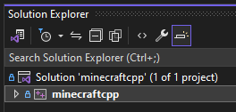

# ReMinecraftPE

This project aims to create a custom Minecraft experience based on Minecraft: Pocket Edition as of 2011. It's
based on the mcpe01_canada.apk build of the game.

**Its goals are:**
* To add Quality-of-Life features to Minecraft: Pocket Edition, such as a brighter color gamut, an in-game
  options menu, etc.
* To add features that were in Minecraft Alpha and the early Betas in 2011. (before and during Minecraft PE's
  development - this excludes hunger, for example, as it was added in Beta 1.8)
* To keep the source code layout similar to the original Minecraft PE (reconstructed from clues hidden within
  certain versions of the game, such as the 0.1.0 touch prototype/debug build)
* To port the game to more platforms, such as Windows (including older versions), Linux, WebGL, Android, and
  macOS. Currently we have ports for:
	* Windows XP-11
	* Linux
	* WebGL
	* macOS (port by [BrentDaMage](https://github.com/BrentDaMage))
	* Xbox 360 (incomplete; port by [BrentDaMage](https://github.com/BrentDaMage))

**We will not do the following:**
* Add features added in or after Java Edition Beta 1.8
* Backport features from versions newer than 0.9.0
* Add The Nether or The End (probably)
* Add Herobrine
* Add support for Minecraft Java or Minecraft Bedrock servers. (although LAN play with original MCPE clients
  will be supported for as long as possible)
* Modify the project structure

Note: The original mcpe01_canada.apk does not work on newer Android devices. A port of this likely will.

### This is the main modded version. For the original decompilation, see [ReMinecraftPE/mcped](https://github.com/ReMinecraftPE/mcped)

## License information

This project is licensed under the [BSD 1 clause license](LICENSE.md). However, it contains third party
software with different but compatible licenses:

- [RakNet](https://github.com/facebookarchive/RakNet): [Licensed under the BSD 2 clause license](thirdparty/raknet/LICENSE)
- [zlib](https://github.com/madler/zlib): [View license](thirdparty/zlib/LICENSE)

## WANT TO HELP?

Want to help this project? [Here's a list of things left to do.](TODO.md)

## DISCLAIMER

This project **requires** you to have a copy of the `mcpe01_canada.apk` (sha256 of the `libminecraftpe.so`
inside: `74b1d3b51a174c4dcaaa58d2bbdf7a4f4c9cfe5f2aeec4844427c2b8f1124343`), before you can build.

## Setup

Before trying to build:

1. Run the following `git` commands, or perform the following actions with Git:
```
git submodule init
git submodule update
```

This fetches the three dependencies we have:
- [zlib](https://github.com/madler/zlib)
- [coi-serviceworker](https://github.com/gzuidhof/coi-serviceworker)
- [gles-compatibility-layer](https://github.com/TheBrokenRail/gles-compatibility-layer.git)

2. Load the sound assets into the `sound_data/` folder in the root of the project
by **running the following command**:
* `tools/grabsounds.py /path/to/the/mcpe01_canada/lib/armeabi-v7a/libminecraftpe.so`.

After that, **prepare the assets folder** from mcpe01_canada.apk. You will need it for the platform specific
build.

## Building

### Windows (VS 2022)

The project is configured to target Windows XP by default by using "v141_xp" build tools. If you would like
to build with Windows XP support, please follow the guide [here](https://learn.microsoft.com/en-us/cpp/build/configuring-programs-for-windows-xp?view=msvc-170#install-the-windows-xp-platform-toolset)
to obtain the build tools via the Visual Studio installer.

**If you would like to strictly target more modern versions of Windows, you can change the build toolset by
doing the following:**

1. Right-click the project and click "Properties".




2. Click the dropdown for the "Platform Toolset" property and select "Visual Studio 2022 (v143)" or newer.


3. Click "Apply".

Install the [DirectX SDK (June 2010)](https://www.microsoft.com/en-US/download/details.aspx?id=6812), unless:
- You opt to use OpenAL instead (but that will require some hacking)
- You are using the latest platform toolset

Once you have the proper build tools installed (v140_xp or newer), you can now build it.

After building, place the `assets` folder you have prepared in the working directory of the output executable.
(if running from VS, it's in `game/`, otherwise, where your executable is)

### Windows (VS 2010)

This target is only around for testing to allow for building on older versions of Windows and to allow for the
potential targetting of pre-XP versions of Windows. The VS2022 target will also build for XP, so using it over
the VS2010 one is recommended.

To compile, you will **need the Microsoft Platform SDK and the DirectX (June 2010) SDK**. After that, follow
the same steps as the VS2022 build. (open the minecraftcpp_vs2010.sln project instead of the minecraftcpp.sln
project).

**Note!** If you are running from within VirtualBox, disable mouse integration (absolute mouse), or the camera
won't work properly.

### WebAssembly

**Make sure you have CMake and Ninja installed. On Windows, the ninja executable must be in your PATH.**
On Linux, the package names are `cmake` and `ninja-build` respectively if you are using apt.

The game will use the assets from within the `game/` directory. So put your assets there if you want to build
for wasm. Then run the `build-wasm` script corresponding to your platform (`-.sh` on linux/WSL, `-.bat` on
windows).

The output files will be in `./wasm/dist`, but you need to upload them to a web host (localhost works too) to
use. (problem with Emscripten)

**NOTE:** If you are using nginx, make sure the `*.wasm` file is served as `application/wasm`, and not
`application/octet-stream`. This can be done by opening `/etc/nginx/mime.types` as root and adding
`application/wasm wasm;` to the types block.

## Linux

You will need `libopenal-dev` and `libsdl2-dev` to play (the package names for OpenAL and SDL2 respectively,
if you are using apt). Then simply run the makefile with the `make` command.

## Have seams when playing?

I've had texture seams when playing Minecraft Classic, ClassiCube and this recreation of Minecraft PE, on a
fresh new laptop. If seams bother you, and you are using an NVIDIA graphics card, go to the NVIDIA Control
Panel, then in "Manage 3D Settings", change "Antialiasing - Mode" to "Application Controlled".

## Notes on assets

The terrain.png and related textures appear to have stayed the same between the E3 demo and the final release
for Xperia PLAY. It appears to have been fetched before Java Edition Beta 1.4's release. This can be seen
because the cookie's texture is missing. (it was added in Java Edition Beta 1.4)

## Screenshots (from the decomp)


## Enhancements

All enhancements (and more) that are available in the decomp version are turned on by default, but only some
of them can be disabled, and the GameMods.hpp file used to control them is deprecated and will be removed.
Check the decomp version's repository for a partial list of enhancements that were added to the game.
